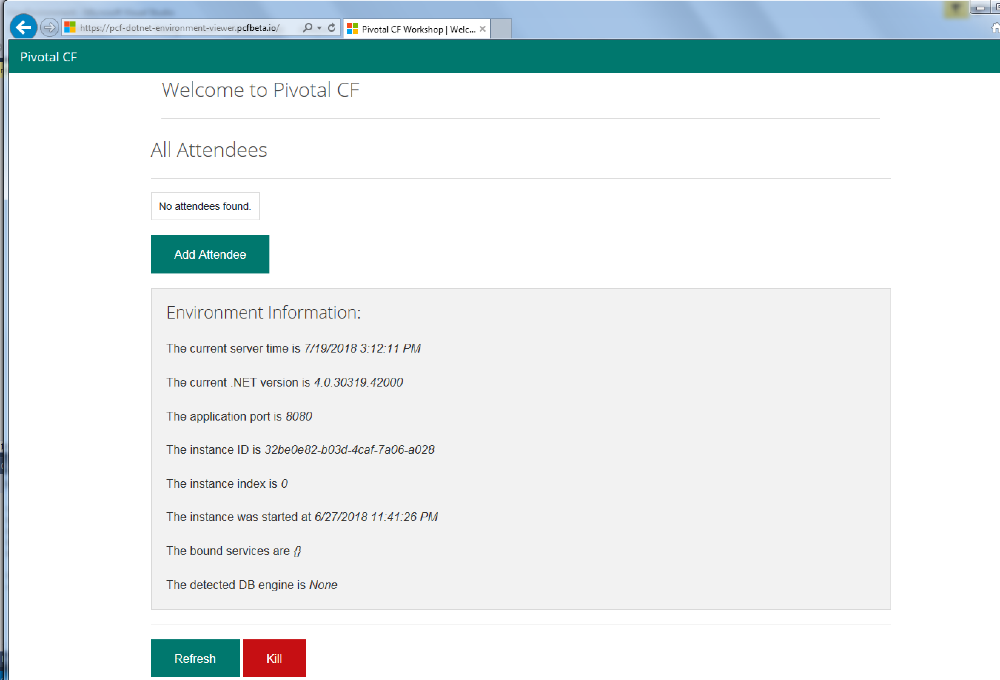

= Lab 1 - From Zero to Pushing Your .NET Framework First Application

== Target

. If you haven't already, download the latest release of the Cloud Foundry CLI from https://github.com/cloudfoundry/cli/releases for your operating system and install it.

. Set the API target for the CLI: (set appropriate end point for your environment)
+
----
$ cf api https://api.sys.gn01.pcf.dcsg.com --skip-ssl-validation
----

. Login to Pivotal Cloud Foundry:
+
----
$ cf login
----
+
Follow the prompts

== Clone the Sample Project

. Clone the .NET Framework _PCF DotNet Environment Viewer_ application
----
$ cd $BOOTCAMP_HOME/..
$ git clone https://github.com/mid-atlantic-pa/pcf-dotnet-environment-viewer.git
----

== Build the Sample Project

. Open the visual studio solution at $BOOTCAMP_HOME/../pcf-dotnet-environment-viewer/ViewEnvironment.sln
. Choose Build -> Build Solution

== Push It!

. Change to the _pcf-dotnet-environment-viewer_ sample application directory:
+
----
$ cd $BOOTCAMP_HOME/../pcf-dotnet-environment-viewer/ViewEnvironment
----

. Push the application!
+
----
$ cf push
----
+
You should see output similar to the following listing. Take a look at the listing callouts for a play-by-play of what's happening:
+
====
----
Using manifest file C:\Users\VM User\dev\code\temp\pcf-dotnet-environment-viewer
\ViewEnvironment\manifest.yml <1>
Getting app info...
Creating app with these attributes...
+ name:       pcf-dotnet-environment-viewer
  path:       C:\Users\VM User\dev\code\temp\pcf-dotnet-environment-viewer\ViewE
nvironment
+ memory:     512M
+ stack:      windows2016
  routes:
+   pcf-dotnet-environment-viewer.pcfbeta.io

Creating app pcf-dotnet-environment-viewer...
Mapping routes... <2>
Comparing local files to remote cache...
Packaging files to upload...
Uploading files... <3>
 123.32 KiB / 123.32 KiB [=========================================] 100.00% 1s
 123.32 KiB / 123.32 KiB [=========================================] 100.00% 1s
Waiting for API to complete processing files...

Staging app and tracing logs... <4>
   Cell d6e87408-cb5e-4d27-9d03-573798076c9b creating container for instance 096
a22ec-5f44-45e9-a41d-e93be36929f5
   Cell d6e87408-cb5e-4d27-9d03-573798076c9b successfully created container for
instance 096a22ec-5f44-45e9-a41d-e93be36929f5
   Downloading app package...
   Downloaded app package (749.3K)
   -----> Hwc Buildpack version 2.3.17
   -----> Installing HWC
          HWC version 11.0.0
   -----> Installing hwc 11.0.0
          Copy [C:\tmp\buildpacks\aff34fb20c2b86d29dd4be4a2efd3589\dependencies\
5f74b9fa818ecff26e261d8d1f764c3f\hwc-11.0.0-windows-amd64-c6a1d00b.zip]
   Exit status 0
   Uploading droplet, build artifacts cache...
   Uploading build artifacts cache...
   Uploading droplet...
   Uploaded build artifacts cache (195B)
   Uploaded droplet (2.2M) <5>
   Uploading complete
   Cell d6e87408-cb5e-4d27-9d03-573798076c9b stopping instance 096a22ec-5f44-45e
9-a41d-e93be36929f5
   Cell d6e87408-cb5e-4d27-9d03-573798076c9b destroying container for instance 0
96a22ec-5f44-45e9-a41d-e93be36929f5
   Cell d6e87408-cb5e-4d27-9d03-573798076c9b successfully destroyed container fo
r instance 096a22ec-5f44-45e9-a41d-e93be36929f5

Waiting for app to start...
<6>
name:                pcf-dotnet-environment-viewer
requested state:     started
instances:           1/1
isolation segment:   main
usage:               512M x 1 instances
routes:              pcf-dotnet-environment-viewer.pcfbeta.io
last uploaded:       Thu 19 Jul 10:53:10 EDT 2018
stack:               windows2016
buildpack:           hwc 2.3.17
start command:       .cloudfoundry\hwc.exe

     state     since                  cpu    memory      disk      details
#0   running   2018-07-19T14:53:59Z   0.0%   0 of 512M   0 of 1G
----
<1> The CLI is using a manifest to provide necessary configuration details such as application name, memory to be allocated, and path to the application artifact.
Take a look at `manifest.yml` to see how.
<2> All HTTP/HTTPS requests to applications will flow through Cloud Foundry's front-end router called http://docs.cloudfoundry.org/concepts/architecture/router.html[(Go)Router].
Here the CLI is creating a route with random word tokens inserted (again, see `manifest.yml` for a hint!) to prevent route collisions across the default `pcf.dcsg.com` domain.
<3> The CLI finally uploads the application bits to Pivotal Cloudfoundry. Notice that it's uploading _75 files_! This is because Cloud Foundry actually explodes a ZIP artifact before uploading it for caching purposes.
<4> Now we begin the staging process. The https://github.com/cloudfoundry/hwc-buildpack[HWC Buildpack] is responsible for assembling the runtime components necessary to run the application.
<5> The complete package of your application and all of its necessary runtime components is called a _droplet_.
Here the droplet is being uploaded to Pivotal Cloudfoundry's internal blobstore so that it can be easily copied to one or more _http://docs.cloudfoundry.org/concepts/architecture/execution-agent.html[Droplet Execution Agents (DEA's)]_ for execution.
<6> Finally the CLI reports the current status of your application's health.
====

. Visit the application in your browser by hitting the route that was generated by the CLI:
+

== Interact with App from CF CLI

. Get information about the currently deployed application using CLI apps command:
+
----
$ cf apps
----
+
Note the application name for next steps

. Get information about running instances, memory, CPU, and other statistics using CLI instances command
+
----
$ cf app <<app_name>>
----

. Stop the deployed application using the CLI
+
----
$ cf stop <<app_name>>
----

. Delete the deployed application using the CLI
+
----
$ cf delete <<app_name>>
----
